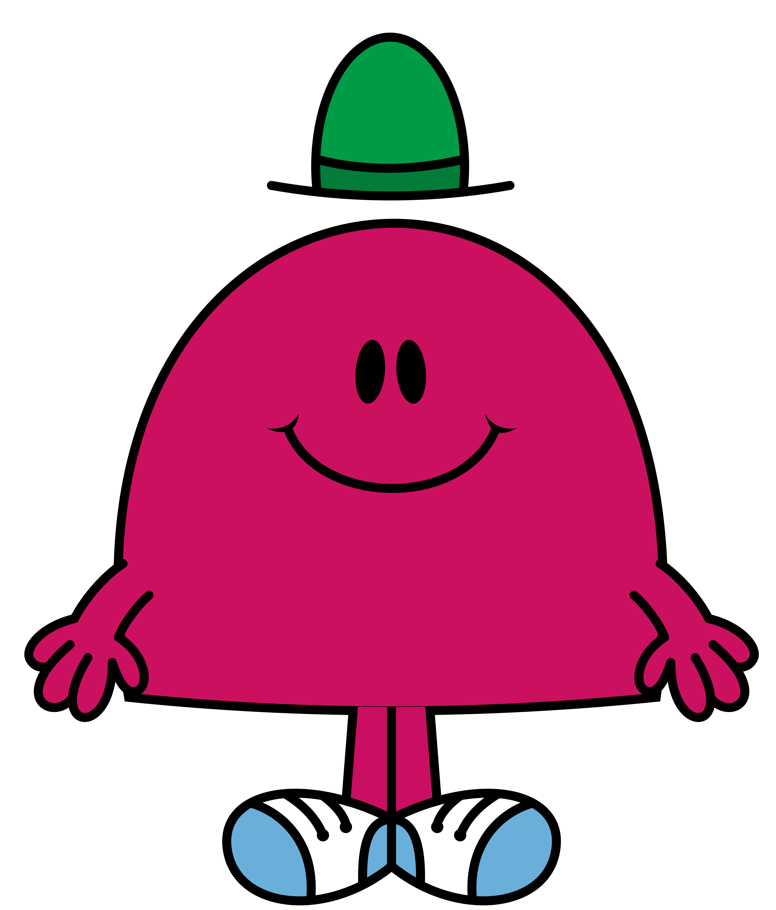

# Group Chat Bot &middot; [](https://snyk.io/test/github/AnthonyKenny98/GroupChatBot?targetFile=requirements.txt) [](https://travis-ci.org/AnthonyKenny98/GroupChatBot) [](https://github.com/AnthonyKenny98/Vend_Inventory_Upload/blob/master/LICENSE)
> Fun ChatBot to be inserted into group chats.

This ChatBot can currently support the following:
  - GroupMe
  
## Table of Contents

+ [Prerequisites](#prereq)
+ [Installation/Setup](#setup): Instructions for setting up your own chatbot.
+ [Features](#features): What can the GroupChatBot do?
+ [Configuration](#config): What can the GroupChatBot do?
+ [API Reference](#api)
+ [Licensing](#license)


## <a name="prereq"></a>Prerequisites
+ [Heroku CLI](https://devcenter.heroku.com/articles/heroku-cli): to setup a server for hosting your bots.
+ [Travis Account](https://travis-ci.org/): Optional, for CI if you fork this repo.
+ [Python 3.7.5](https://www.python.org/downloads/release/python-275/)

At least one of:
+ [GroupMe Developer Account](https://dev.groupme.com/): This is the same as your GroupMe Account. Your Access Token can be found here.

## <a name="setup"></a>Installation/Setup

### Checkout the Code 
  ```
  $ git clone https://github.com/AnthonyKenny98/GroupChatBot.git
  $ cd GroupChatBot
  ```
### Create and Init Virtual Environment
  ```
  $ virtualenv venv
  $ source venv/bin/activate
  ```
### Install Dependencies
  ```
  $ pip3 install -r requirements.txt
  ```
### Setup Heroku (You will need your Heroku Account Credentials).
You will be prompted to enter a Heroku App Name. Name must start with a letter, end with a letter or digit and can only contain lowercase letters, digits, and dashes.
The script will push the application to the heroku server and install all neccesary dependencies.
  ```
  $ ./scripts/heroku_setup.sh
  ```
### Setup a Bot
The following can be repeated for as many bots in as many groupchats as you would like. You will be prompted for your GroupMe Access Token. You will also be prompted to enter the name of your config file. This can be one you define or just enter "default"
  ```
  $ ./scripts/bot_setup.sh
  ```
Congratulations, you have set up your first bot!

## <a name="features"></a>Features

Currently, GroupChatBot can do the following actions once inserted into your group:

### Mad Lib
_Mad Libs is a phrasal template word game where one player prompts others for a list of words to substitute for blanks in a story before reading the – often comical or nonsensical – story aloud. The game is frequently played as a party game or as a pastime. [Wikipedia](https://en.wikipedia.org/wiki/Mad_Libs)_

Mad Libs are set up by you! Navigate to `src/charbot/vocab/default`. Here there should be three files: `sentence.txt`, `adjective.txt` and `noun.txt`. You can add your own sentences, adjectives and nouns. See below for an example

```
  # sentence.txt
  This is a @adjective @noun.
  
  # adjective.txt
  cool
  new
  bad
  good
  example
  
  # noun.txt
  sentence
  string of words
  phrase
```

Additionally, you can add your own dictionaries (new folders within vocab with a similar structure) or add files to the default vocabulary, and reference with the same "@" syntax within sentence.txt.

### Spongebob Mock


This function replies to a user, superimposing their text over the above image and capitalising ever second letter.

### Post Meme
This pulls a random meme from a subreddit of your specification (see Configuration section) and posts it to the Group.

### Reddit Roast
This pulls a random comment from the popular subreddit r/roastme and posts it to the group.

### Cross Map
This aims either a Mad Lib or Reddit Roast at a random group member. 

## <a name="config"></a>Configuration
The GroupChatBot determines which of the above actions to take based on a probability distribution function. You can edit this by putting an integer next to each of the actions within `src/chatbot/config.txt`. These integers do not need to sum to any particular number.

You can also select which subreddits you want the bot to pull memes from, and banned words from reddit roasts, within this file.

## <a name="api"></a>Api Reference

### Group Chat APIs
[GroupMe API](https://dev.groupme.com/)

### Other APIs
[Meme API](https://github.com/R3l3ntl3ss/Meme_Api): Used to find memes from reddit for bot to post.

## <a name="license"></a>Licensing

This project is licensed under the MIT License.  See the [LICENSE](LICENSE) file for more information.
